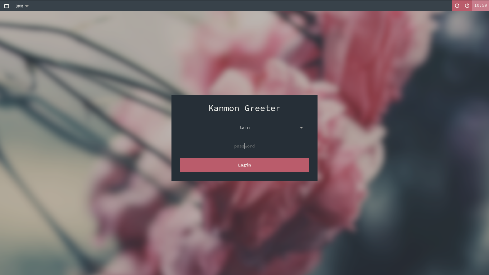

# Kanmon
Modification of [lightdm-webkit2-dmg_blue](https://github.com/davidmogar/lightdm-webkit2-dmg_blue)

## Features

This theme is designed to be simple, so it provides the bare minimum to be usable:
* Selection of user, remembering the last user who loged into the system.
* Selection of session (fetching the list of installed desktop environments).
* Session cache for each user, remembering the last session used.
* Shutdown and restart buttons.
* Displaying hostname
* Displaying current time

## Installation instructions

The theme depends on `lightdm-webkit2-greeter`. This package can be installed in Arch Linux with `pacman -S --needed lightdm-webkit2-greeter`. Once done:

* Git clone this repository into `/usr/share/lightdm-webkit/themes/`
* Edit `/etc/lightdm/lightdm-webkit2-greeter.conf` and set `webkit_theme` to `lightdm-webkit2-kanmon`.

## License

This project is under the GNU General Public License v3.0. Check [LICENSE](https://github.com/davidmogar/lightdm-webkit2-dmg_blue/blob/master/LICENSE) file to see the full text full text.
